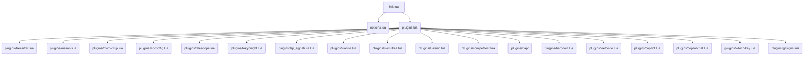

# 🚀 Mi Configuración de Neovim por Jerimy Pierre Sandoval Rivera

¡Bienvenido a mi configuración personal de Neovim! Este repositorio contiene todos los archivos de configuración y plugins que utilizo para transformar Neovim en un IDE potente y eficiente, adaptado a mis preferencias de desarrollo como Jerimy Pierre Sandoval Rivera.

He dedicado tiempo a perfeccionar esta configuración para optimizar mi flujo de trabajo, ofreciendo una experiencia de desarrollo fluida y altamente productiva.

## 🌟 Visión General de la Configuración

La configuración se estructura de manera modular para facilitar su gestión y comprensión. Los archivos principales `init.lua`, `options.lua` y `plugins.lua` orquestan la carga de configuraciones específicas.



## ✨ Características y Componentes Clave

Mi configuración está diseñada para cubrir las necesidades de desarrollo moderno, desde la edición básica hasta la depuración avanzada y la programación competitiva.

### 🔌 Gestión de Plugins

*   **`lazy.nvim`**: El corazón de la gestión de plugins. `lazy.nvim` asegura una carga rápida y eficiente de todos los componentes, permitiendo un inicio de Neovim ágil.

### 🚀 Desarrollo Asistido por IA

*   **`Copilot` y `CopilotChat`**: Integración profunda con GitHub Copilot para autocompletado inteligente de código, sugerencias contextuales y asistencia conversacional, acelerando significativamente el proceso de codificación.

### 💡 Autocompletado y LSP

*   **`nvim-cmp`**: Un potente motor de autocompletado que se integra con diversas fuentes, incluyendo LSP.
*   **`lspconfig`**: Configuración unificada para la integración con el Protocolo de Servidores de Lenguaje (LSP), proporcionando funcionalidades IDE-like como:
    *   **Autocompletado contextual**
    *   **Ir a definición / declaración / implementación**
    *   **Renombrado de símbolos**
    *   **Diagnósticos en tiempo real** (errores, advertencias)
    *   **Formateo de código**
*   **`lsp_signature`**: Muestra información de la firma de funciones/métodos mientras escribes, mejorando la claridad y la precisión del código.

### 🔎 Navegación y Búsqueda

*   **`Telescope`**: Una herramienta de búsqueda difusa y extensible para todo, desde archivos (`find_files`), buffers (`buffers`), historial de Git (`git_commits`) hasta comandos (`commands`) y mucho más, todo con una interfaz interactiva.
*   **`nvim-tree`**: Un explorador de archivos estilo árbol que facilita la navegación por la estructura del proyecto.

### 🖥️ Interfaz y Experiencia de Usuario

*   **`Tokyo Night`**: Mi tema de color preferido, `Tokyo Night`, ofrece una estética moderna y agradable a la vista, con una paleta de colores optimizada para la codificación.
*   **`lualine`**: Una línea de estado altamente personalizable y funcional que muestra información crucial como el modo actual de Neovim, el nombre del archivo, la rama de Git, el estado de LSP y mucho más.
*   **`nvim-treesitter`**: Proporciona un resaltado de sintaxis mucho más preciso y una comprensión estructural del código, lo que mejora la legibilidad y permite funcionalidades avanzadas de edición.

### 🧰 Herramientas de Productividad

*   **`which-key`**: Una herramienta indispensable que muestra los atajos de teclado disponibles después de presionar el `mapleader`, ayudándote a descubrir y recordar comandos.
*   **`gitsigns`**: Muestra visualmente los cambios de Git directamente en el margen del editor, indicando líneas añadidas, modificadas o eliminadas.
*   **`LuaSnip`**: Un motor de snippets modular y potente, que permite la expansión rápida de fragmentos de código predefinidos.
*   **`Harpoon`**: Una herramienta para marcar y navegar rápidamente entre archivos importantes en tu proyecto, ideal para alternar entre archivos relacionados sin perder el contexto.

### 🐞 Depuración (DAP)

Mi configuración incluye una suite completa para la depuración:

*   **`nvim-dap`**: El adaptador de protocolo de depuración (DAP) central de Neovim.
*   **`nvim-dap-ui`**: Una interfaz de usuario para DAP que proporciona una experiencia de depuración visual e interactiva.
*   **`mason-nvim-dap`**: Extiende Mason para facilitar la instalación y gestión de adaptadores DAP.
*   **`cmp-dap`**: Integración de DAP con `nvim-cmp` para autocompletado durante la depuración.
*   **`nvim-dap-virtual-text`**: Muestra el estado de las variables y otros datos de depuración directamente en el editor como texto virtual.
*   **`telescope-dap`**: Permite buscar y gestionar sesiones de depuración con Telescope.

### 🏆 Programación Competitiva

*   **`Competitest`**: Herramienta para probar y ejecutar soluciones de programación competitiva.
*   **`Leetcode.nvim`**: Integración con la plataforma LeetCode, permitiendo resolver problemas directamente desde Neovim.

## ⌨️ Atajos de Teclado y Opciones Globales

Mi `mapleader` está configurado como la **barra espaciadora** (`<Space>`), lo que sirve como prefijo para la mayoría de mis atajos personalizados. Esto mantiene la configuración limpia y accesible.

Las opciones globales en `options.lua` establecen el comportamiento fundamental de Neovim:

*   `vim.g.mapleader = " "`: Define la barra espaciadora como el prefijo para los atajos personalizados.
*   `vim.o.clipboard = "unnamedplus"`: Habilita la integración del portapapeles de Neovim con el portapapeles del sistema, permitiendo copiar y pegar fácilmente fuera del editor.
*   `vim.o.signcolumn = "yes"`: Siempre muestra la columna de signos para diagnósticos de LSP y otros marcadores.
*   `vim.o.tabstop = 4`, `vim.o.shiftwidth = 4`: Configura el tamaño de la tabulación y la indentación a 4 espacios.
*   `vim.o.updatetime = 300`: Reduce el tiempo de espera para que se actualicen los eventos (como los diagnósticos de LSP), haciendo el editor más reactivo.
*   `vim.o.termguicolors = true`: Habilita los colores true-color en el terminal, asegurando que el tema `Tokyo Night` se vea correctamente.
*   `vim.o.number = true`: Muestra los números de línea absolutos en el editor.
*   `vim.opt.wrap = false`: Desactiva el auto-ajuste de línea, permitiendo que las líneas largas se extiendan horizontalmente.

Para una exploración detallada de los atajos de teclado específicos de cada plugin, te invito a revisar los archivos de configuración individuales dentro del directorio `lua/plugins/`.

## ⚙️ Instalación

Para instalar y comenzar a usar esta configuración de Neovim:

1.  **Clonar el Repositorio**:
    Si aún no tienes este repositorio clonado en la ubicación estándar de configuración de Neovim, ejecuta:
    ```bash
    git clone https://github.com/tu_usuario/nvim-config.git ~/.config/nvim
    ```
    *Nota: Si este no es un repositorio de GitHub, o si ya lo tienes en la ubicación correcta, puedes omitir este paso.* 

2.  **Iniciar Neovim por primera vez**:
    Abre Neovim desde tu terminal:
    ```bash
    nvim
    ```
    El gestor de plugins `lazy.nvim` se iniciará automáticamente, detectará e instalará todos los plugins definidos en la configuración. Es posible que veas un proceso de descarga e instalación.

3.  **Instalar Servidores de Lenguaje con Mason (Opcional pero Recomendado)**:
    Para obtener las capacidades completas del Protocolo de Servidores de Lenguaje (LSP) para tus lenguajes de programación, abre Neovim y ejecuta el comando de Mason:
    ```vim
    :Mason
    ```
    Desde la interfaz de Mason, puedes seleccionar e instalar fácilmente los servidores de lenguaje, linters y formateadores que necesites para tus proyectos (por ejemplo, `pyright` para Python, `tsserver` para TypeScript, `rust_analyzer` para Rust, etc.).

## 🤝 Contribuir

Siéntete libre de explorar, modificar y adaptar esta configuración a tus propias necesidades. ¡Cualquier sugerencia, mejora o informe de error es bienvenido!

---

**Nota**: Esta configuración está diseñada y probada para **Neovim 0.9.0 o superior**. Asegúrate de tener una versión compatible de Neovim para evitar posibles problemas.
